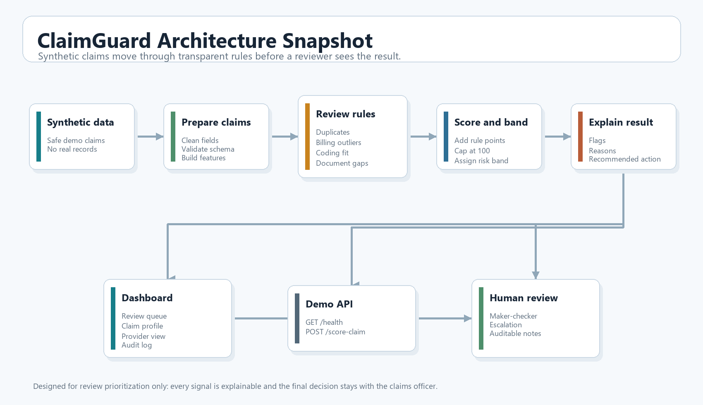
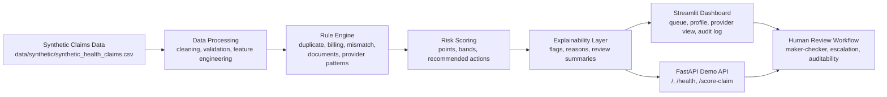

# ClaimGuard Health Risk Engine

**ClaimGuard** is an explainable health claims triage prototype that helps medical claims officers move from manual claim hunting to risk-based claim review.

**Fellowship:** UoN Innovation Fellowship 2025

## Product Pitch

ClaimGuard helps medical claims officers identify and prioritize claims that may require closer human review by surfacing duplicate patterns, abnormal billing, diagnosis-treatment mismatches, missing documents, provider and member patterns, and review recommendations.

## Why This Matters

Medical claims officers often work under time pressure, high claim volumes, and fragmented information. Important review signals can be buried across prior claims, scattered documents, and repeated manual checks. ClaimGuard is designed to make triage faster, clearer, and more explainable without removing human judgment from the process.

## What The MVP Does

- Generates synthetic health claims data with controlled risk patterns
- Runs a modular rule engine for key review indicators
- Aggregates rule outputs into a transparent risk score and risk band
- Recommends a review action aligned to the risk band
- Explains why a claim was flagged in reviewer-friendly language
- Provides a Streamlit dashboard for queue review, claim profiles, provider intelligence, and audit tracking
- Exposes an optional FastAPI endpoint for demo scoring
- Includes unit tests, documentation, and demo outputs

## Architecture Snapshot

This is the flow we used to shape the MVP, from synthetic claims input all the way to reviewer-facing triage and human decision support.



The Mermaid version is included below as a clean reference view in the repository.



## Quick Start

Create a virtual environment:

```powershell
python -m venv .venv
.venv\Scripts\Activate.ps1
```

Install dependencies:

```powershell
pip install -r requirements.txt
```

For Streamlit Community Cloud, the deployed dashboard uses the slimmer dependency file at `app/requirements.txt` because the entrypoint is `app/streamlit_app.py`. This keeps deployment focused on the dashboard instead of installing optional API, test, and experimentation packages.

Generate the synthetic dataset:

```powershell
python src/data_processing/generate_synthetic_claims.py
```

Run the Streamlit dashboard:

```powershell
streamlit run app/streamlit_app.py
```

Run the optional API:

```powershell
uvicorn api.main:app --reload
```

Example request and response payloads are available in [`api/examples/`](./api/examples/).

Run the tests:

```powershell
pytest
```

Generate a rule-impact calibration summary:

```powershell
python -m src.rules.rule_impact_summary
```

## Repository Structure

```text
claimguard-health-risk-engine/
|-- README.md
|-- ROADMAP.md
|-- data/
|-- docs/
|-- notebooks/
|-- src/
|-- app/
|-- api/
|-- tests/
`-- outputs/
```

## Documentation

- [Problem Statement](./docs/problem_statement.md)
- [User Persona](./docs/user_persona.md)
- [System Architecture](./docs/system_architecture.md)
- [Risk Scoring Logic](./docs/risk_scoring_logic.md)
- [Prototype Screens](./docs/prototype_screens.md)
- [Ethical Considerations](./docs/ethical_considerations.md)
- [Streamlit Deployment Guide](./docs/streamlit_deployment.md)
- [Roadmap](./ROADMAP.md)

## Responsible Use

ClaimGuard is a decision-support tool, not an automated accusation system.

- It uses synthetic data only.
- It highlights review flags and risk indicators.
- It does not confirm fraud or wrongdoing.
- It is designed to support human review, not replace it.
- It preserves explainability and auditability as core product requirements.

## Roadmap

The current MVP already covers synthetic data, explainable rules, risk scoring, dashboard views, a demo API, tests, and documentation. The next build focuses on the gaps that matter most for a claims officer: persisted review actions, clearer related-claim context, configurable rule calibration, API examples, and polished demo screenshots.

See [ROADMAP.md](./ROADMAP.md) for the detailed next-step plan, acceptance criteria, and longer-term phases.

## Authors

- John Andrew
- Avery Inyangala
- Jackson Mwamba
- Victor Mwilu
- James Mule

## Project Context

Built as part of the **UoN Innovation Fellowship 2025**.
