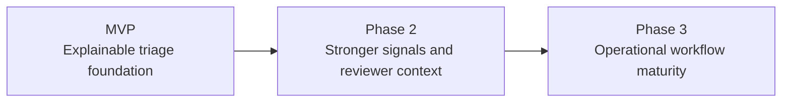
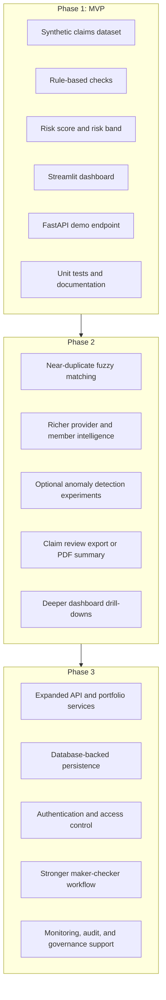

# Roadmap

ClaimGuard is being developed in phases so the prototype remains explainable, demo-ready, and grounded in practical reviewer needs while still leaving room for stronger workflow and analytics capabilities.

## Development Flow

## Phase Detail

## MVP

Focus: establish a strong decision-support prototype for explainable claims triage.

- Synthetic claims dataset with controlled high-risk patterns
- Rule-based checks for duplicate claims, abnormal billing, diagnosis-treatment mismatch, document completeness, and provider signals
- Claim-level risk score, risk band, recommended action, and explanation layer
- Streamlit dashboard with queue, claim profile, provider intelligence, and audit log views
- Basic FastAPI demo scoring endpoint
- Unit tests for rules, scoring, and workflow logic

## Phase 2

Focus: improve signal quality and reviewer context.

- Near-duplicate fuzzy matching with RapidFuzz
- Richer provider and member pattern intelligence
- Optional anomaly detection experiments for outlier discovery
- Claim risk export or PDF-style summary for case review
- Stronger dashboard drill-downs and reviewer notes

## Phase 3

Focus: move from prototype storytelling toward operational readiness concepts.

- Expanded FastAPI scoring and portfolio endpoints
- Database integration for persistent claims and audit events
- Authentication and role-aware access patterns
- More explicit maker-checker workflow controls
- Model and rule monitoring, audit trail improvements, and governance reporting

## Guiding Principle

Every phase should preserve the same core boundary: ClaimGuard should help people review claims more effectively, not automate accusations or remove human judgment from the process.
