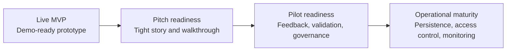

# Roadmap

ClaimGuard is now a live, explainable claims-review MVP. The next roadmap should help the team move from "working prototype" to "credible pilot candidate" without weakening the ethical boundary: the tool supports human review and does not confirm fraud or wrongdoing.

Live demo: <https://claimguard-health-risk-engine.streamlit.app/>

## Current MVP Status

The repository currently includes:

- Synthetic health claims generator and demo dataset
- Rule engine for duplicate patterns, abnormal billing, diagnosis-treatment mismatch, provider pattern risk, and missing documents
- Claim-level risk score, risk band, recommended action, and explanation layer
- Streamlit dashboard with review queue, claim profile, provider intelligence, and audit log
- Related-claim context for same member, same provider, diagnosis, date, and amount checks
- Local CSV-backed demo audit persistence with session fallback
- YAML-configurable rule parameters and generated rule-impact summaries
- Optional FastAPI scoring endpoint with request and response examples
- Unit tests for rules, scoring, workflow, API, audit log, related claims, and calibration summary
- Public GitHub repository and live Streamlit deployment

## Roadmap Flow

## Immediate Priority: Pitch Readiness

Focus: help reviewers, judges, and partners understand the prototype quickly.

- Keep the live demo link visible in the README and pitch brief
- Use a consistent three-minute demo path: queue, claim profile, provider intelligence, audit log
- Highlight the real reviewer problem: volume, fragmented context, repeated checks, and pressure to prioritize
- Show concrete outputs: risk score, risk band, rule flags, explanations, recommended action, and audit trail
- Keep responsible-use language clear: "review signal", "triage", "verification", and "human decision"

Acceptance criteria:

- A judge can understand the problem and solution in under two minutes
- The demo can be completed without local setup
- The app clearly shows why a claim was prioritized
- The repository explains what is synthetic, what is live, and what is not production-ready

## Next Build: Pilot Readiness

Focus: make the prototype credible for a controlled, governed pilot.

### 1. Reviewer Feedback Loop

- Add a reviewer decision field that captures whether a flag was useful, unclear, or not useful
- Track feedback by rule type so thresholds can be improved
- Add a small feedback summary page or section in the audit log

Success measure:

- The team can show which rules are useful and which create noise.

### 2. Stronger Audit Persistence

- Move from local CSV demo persistence to SQLite for local pilot testing
- Preserve audit events, reviewer notes, status transitions, and rule configuration version
- Keep CSV download for demos and handoff

Success measure:

- Review actions survive app refreshes and local restarts.

### 3. Rule Calibration And QA

- Expand `rule_impact_summary` to compare threshold changes
- Add a simple calibration report for flagged claims by rule and risk band
- Add tests for missing columns, malformed dates, and empty datasets

Success measure:

- The team can explain why thresholds are set where they are.

### 4. More Realistic Synthetic Scenarios

- Add synthetic outpatient, inpatient, pharmacy, lab, and emergency claim mixes
- Add edge cases for partial approvals, pending claims, and missing admission dates
- Add synthetic reviewer outcomes for calibration exercises

Success measure:

- The demo feels closer to a real claims queue without using real data.

### 5. Deployment And Demo Reliability

- Keep `app/requirements.txt` slim for Streamlit deployment
- Add a deployment smoke-test checklist after each push
- Capture final dashboard screenshots for the pitch deck

Success measure:

- The live app redeploys quickly and consistently.

## Phase 2: Workflow And Intelligence

Focus: improve the reviewer experience and pattern intelligence.

- Add RapidFuzz-based near-duplicate matching for provider names, procedure descriptions, and minor coding variations
- Build richer provider and member profiles using synthetic historical context
- Add rule trend views: flags by rule type, provider type, claim channel, and claim status
- Generate a claim review pack in HTML or PDF-style format
- Add batch scoring API endpoint for multiple claims
- Add role-aware maker-checker states for maker, checker, and escalation owner

## Phase 3: Operational Readiness Concepts

Focus: outline what would be required before any real-world deployment.

- Database-backed claim, provider, review-action, and audit-event tables
- Authentication and role-based access control
- Rule versioning and score reproducibility
- Monitoring for rule drift, flag volume, reviewer outcomes, and false-positive patterns
- Privacy, fairness, and clinical/claims validation review
- Governance process for appeals, overrides, and model/rule updates

## Not In Scope For The MVP

- Real patient or provider data
- Automated claim rejection
- Confirmed fraud classification
- Production authentication or enterprise deployment
- Black-box-only scoring
- Replacing medical or claims officer judgment

## Guiding Principle

Every next step should make ClaimGuard more useful, explainable, and safe for human review. A higher risk score should always mean "review this more carefully", not "wrongdoing is confirmed".
