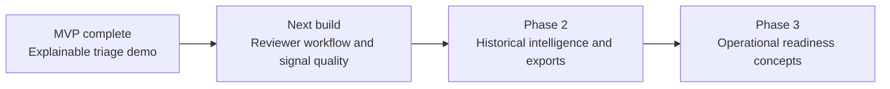
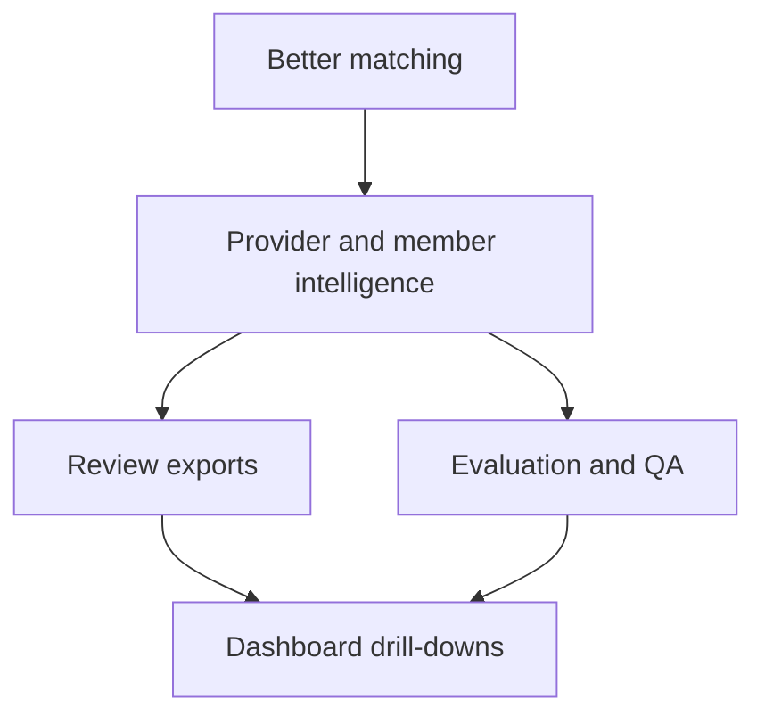

# Roadmap

ClaimGuard is being built as an explainable claims-review prototype, not as an automated fraud decision system. The roadmap below reflects the current repository state and the most useful next steps for turning the MVP into a stronger fellowship demo and a credible product concept.

## Current Status

The repository already includes the core MVP foundation:

- Synthetic health claims generator and demo CSV output
- Data dictionary and synthetic data documentation
- Rule engine for duplicate claims, abnormal billing, diagnosis-treatment mismatch, provider pattern risk, and missing documents
- Claim-level risk score, risk band, recommended action, and explanation layer
- Streamlit dashboard with review queue, claim profile, provider intelligence, and audit log pages
- Optional FastAPI scoring endpoint for single-claim demonstration
- Unit tests for major rules, scoring, explainability, and workflow logic
- Demo outputs and project documentation

The next work should not be about adding random features. It should make the existing prototype more useful to a claims officer: better context, clearer review workflow, stronger validation, and easier demonstration.

## Roadmap Flow

## Immediate Next Build

Focus: strengthen the current MVP without over-engineering it.

Current implementation progress:

- Persisted demo audit actions: implemented with local CSV persistence and session fallback
- Related-claim context: implemented with same-member, same-provider, diagnosis, date, and amount checks
- Rule calibration: implemented with generated rule-impact summaries
- API examples and endpoint tests: implemented
- Streamlit deployment readiness: implemented with deployment config and guide

### 1. Persist Reviewer Actions

Why it matters: the dashboard currently demonstrates review actions, but actions are not stored beyond the Streamlit session.

- Add a lightweight local persistence option for audit events, such as SQLite or CSV-backed logs
- Save reviewer note, action, timestamp, previous status, new status, and reviewer role
- Show persisted actions on the Audit Log page
- Keep the implementation local and simple for demo use

Acceptance criteria:

- A reviewer can mark a claim as reviewed, send it to checker, or escalate it
- The action remains visible after refreshing the dashboard
- No real user or patient data is required

### 2. Improve Related-Claim Context

Why it matters: duplicate and member-frequency signals are more useful when a reviewer can see the surrounding claims.

- Add a related claims panel for same member, same provider, same diagnosis, and close claim dates
- Make near-duplicate matches visible from the Claim Risk Profile page
- Add clear wording that related claims are review context, not proof of wrongdoing
- Reuse the existing synthetic dataset rather than introducing external data

Acceptance criteria:

- Selecting a flagged claim shows the most relevant nearby claims
- The panel explains why each related claim is shown
- Claims outside the matching criteria are not presented as duplicates

### 3. Calibrate Rule Thresholds

Why it matters: the MVP has good explainable rules, but thresholds should be easy to tune and defend.

- Move duplicate, billing, provider-pattern, and document thresholds fully into `src/config/risk_rules.yaml`
- Add a small calibration notebook or script that reports how many claims each rule flags
- Include a before-and-after summary when thresholds change
- Keep defaults conservative enough for a demo review queue

Acceptance criteria:

- A team member can change thresholds in YAML without editing rule code
- The repo can generate a rule-impact summary from synthetic data
- Risk scoring remains reproducible after threshold changes

### 4. Add API Examples And Validation Tests

Why it matters: the API exists, but it needs stronger demo evidence.

- Add example request and response JSON for `POST /score-claim`
- Add unit tests or lightweight integration tests for `/health` and `/score-claim`
- Document the limitation that single-claim API scoring has reduced duplicate and provider-history context

Acceptance criteria:

- A reviewer or demo judge can copy a sample payload and get a valid response
- API tests run with `pytest`
- The API response keeps the responsible-use disclaimer

### 5. Polish Demo Screens

Why it matters: the Streamlit dashboard is the main story surface for a fellowship or portfolio review.

- Add screenshots for each dashboard page under `outputs/screenshots/`
- Update `docs/prototype_screens.md` with actual screenshot links
- Add a short walkthrough: generate data, run dashboard, open a high-risk claim, view explanation, record a review action

Acceptance criteria:

- A new visitor can understand the product in under two minutes from the README
- The screenshots match the current dashboard
- The walkthrough uses synthetic data only

## Phase 2

Focus: improve the quality of review signals and the amount of context available to the claims officer.

### Planned Work

- Add RapidFuzz-based near-duplicate matching for provider names, procedure descriptions, and minor coding variations
- Build richer provider and member profiles using synthetic history, including frequency, average amount, repeated diagnosis patterns, and document-gap rates
- Add optional anomaly detection experiments as supporting context, not as the main scoring method
- Generate claim review packs in HTML or PDF-style format for case handoff
- Add dashboard drill-downs for rule trends, provider summaries, and member history
- Add more tests for edge cases, missing columns, malformed dates, and API validation

### Phase 2 Guardrails

- Keep the rule trail visible for every score
- Do not introduce real patient, provider, or company data
- Treat anomaly detection as an exploratory signal only
- Avoid language that confirms fraud or assigns blame

## Phase 3

Focus: describe what operational readiness would require if the prototype moved beyond a hackathon or fellowship demo.

### Planned Work

- Add database-backed claim, provider, review-action, and audit-event tables
- Expand FastAPI routes for claim lists, provider summaries, scoring batches, and audit records
- Add authentication and role-aware access patterns for maker, checker, and admin users
- Formalize maker-checker workflow states, including assignment, review, checker decision, escalation, and closure
- Add rule versioning so historical scores can be traced back to the rule configuration used at the time
- Add monitoring views for rule drift, flag volume, reviewer decisions, and false-positive review outcomes
- Define a validation plan before any real-world deployment, including fairness review, privacy controls, and governance sign-off

## Not In Scope For The MVP

- Real patient or provider data
- Automated claim rejection
- Confirmed fraud classification
- Production authentication or enterprise deployment
- Black-box-only scoring
- Replacing medical or claims officer judgment

## Guiding Principle

Every next step should make ClaimGuard more useful, explainable, and safe for human review. A higher risk score should always mean "review this more carefully", not "wrongdoing is confirmed".
