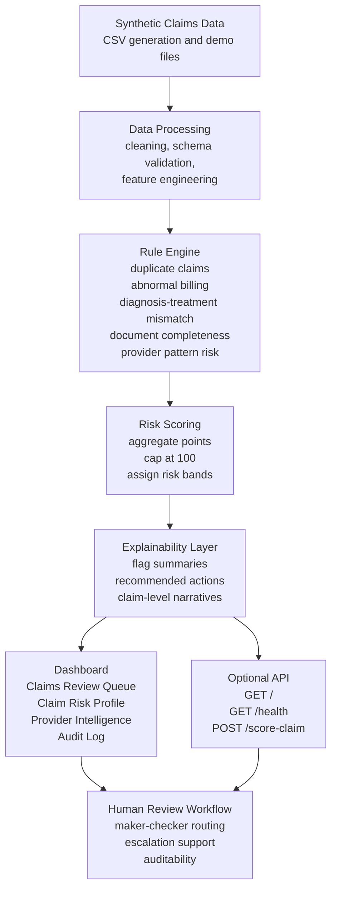

# System Architecture

ClaimGuard is structured as a modular prototype so that each part of the pipeline can be understood, tested, and extended independently. The architecture is intentionally simple: synthetic claims flow through a transparent rule engine, then into scoring, explainability, dashboard views, and an optional API.

## Architecture Flow

## Core Components

- **Synthetic claims data**
  - Stored under `data/synthetic/`
  - Used for demonstrations, tests, and UI walkthroughs
  - Includes controlled risky patterns to showcase duplicates, billing anomalies, document gaps, and provider or member signals

- **Data processing**
  - Cleans and normalizes claim fields
  - Validates schema expectations
  - Generates lightweight derived fields used by the rule engine

- **Rule engine**
  - Evaluates explainable checks such as:
    - exact and near duplicate claims
    - abnormal billing by diagnosis and procedure pattern
    - diagnosis-treatment mismatch
    - missing supporting documents
    - provider-level pattern risk

- **Risk scoring**
  - Aggregates rule points into a capped claim-level score
  - Assigns a risk band
  - Maps the band to a recommended review action
  - Preserves the rule trail for auditability

- **Explainability layer**
  - Turns flagged rule outputs into concise claim explanations
  - Helps reviewers understand why a claim was prioritized

- **Dashboard**
  - Streamlit interface for reviewers
  - Presents queue, claim profile, provider intelligence, and audit log views

- **Optional API**
  - FastAPI endpoints for demo scoring and portfolio access
  - Supports lightweight integration demonstrations

- **Human review workflow**
  - Supports maker-checker thinking
  - Demonstrates escalation-aware review paths
  - Keeps human reviewers in control of final decisions

## Design Principles

- Explainability first
- Synthetic data only
- Human-in-the-loop review
- Modular components with clear interfaces
- Configurable rule logic through YAML
- Demo-ready outputs without overstating real-world readiness
